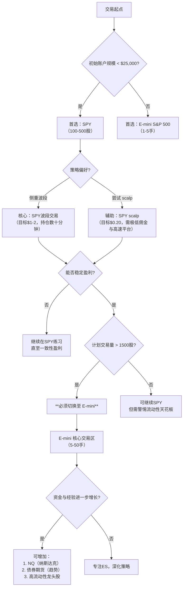

nav_title: "学习总结"
```markdown
# Chapter 12 学习总结：市场环境与交易工具选择

## 核心导论：为何市场选择是交易成功的第一课

价格行为（Price Action）技术分析理论具有普适性，理论上适用于所有流动性市场。然而，**实战成功的核心不仅在于技术形态的识别，更在于选择与自身交易风格、资金规模、心理承受能力及技术熟练度高度匹配的交易市场**。本章的核心目标是解决一个根本性问题：**“我应该交易什么？”**

一个理想的市场应具备以下特征：
1.  **高频率信号**：在5分钟等短期图表上提供充足、清晰的交易信号（入场点）。
2.  **深度流动性**：能够容纳大额订单而不会产生显著的滑点（Slippage），即成交价与预期价的偏差。
3.  **合理波动率**：价格波动足以产生盈利空间，但又不至于剧烈到导致频繁止损。
4.  **低交易成本**：佣金、点差等成本结构必须有利于高频或小额交易策略的盈利。

对于日间交易者（Day Trader）而言，市场选择是一个动态调整的过程，需随账户规模、经验值和策略成熟度的增长而进化。本章将主要市场分为**股指类（期货与ETF）、债券类、外汇类及个股类**，并深入剖析其特性、适用阶段及关键实战要点。

---

## 1. 股指期货：专业交易者的核心战场

### 1.1 E-mini S&P 500 期货：无可争议的“王者”

**合约规格**：代码 `ES`，合约乘数为50美元（即指数每点变动价值50美元）。例如，指数从4000.00变动至4001.00，盈利/亏损为50美元。

**核心优势**：
- **无与伦比的流动性**：全球交易量最大的股指期货合约，买卖价差极窄，**任何个体交易者能想到的订单规模（从1手到数百手）都能被市场瞬间消化，滑点几乎可以忽略不计**。这是其“永不过时”的根本原因。
- **完美的波动性匹配**：其平均每日波幅（Average Daily Range）和日内波段（Swing）大小，为波段交易（Swing Trading）和短线波段交易（Scalping）提供了理想的空间。典型的日内波段在10-20点（500-1000美元/手），而 scalp 目标通常在2-4点（100-200美元/手）。
- **与SPY的完美对应**：E-mini S&P 500 与 SPDR S&P 500 ETF（代码 `SPY`）在价格上高度同步，但**合约价值不同**：1手 E-mini ≈ 500股 SPY。这为资金大小的过渡提供了无缝衔接的桥梁。

**适用交易者**：
- **所有阶段的严肃交易者**：从最初学习技术分析（交易1手）到管理大资金（交易数十甚至上百手），ES都是终极工具。它是衡量交易者是否“毕业”的标准——当你在ES上能稳定盈利时，意味着你已具备交易任何市场的技术基础。

**实战要点**：
- **止损设置**： scalp 常用2-4点止损（100-200美元/手），波段交易常用5-10点或基于波动率（ATR）的动态止损。
- **交易时段**：主要跟随美国股市交易时段（东部时间9:30-16:00），盘前（Pre-market）和盘后（After-hours）流动性显著下降。
- **关键时间点**：**美东时间9:30开盘**是波动最大的时刻，常出现“开盘_range”和“开盘突破/反转”。**美东时间10:00**常有经济数据发布（如ISM、CPI），可能引发剧烈波动。**美东时间15:30-16:00**为收盘时段，机构调仓可能导致价格异动。

---

## 2. ETF：新手的最佳起点与灵活工具

### 2.1 SPY（S&P 500 ETF）：完美的“训练场”

**核心价值**：对于**初始资金较小（通常低于25,000美元，符合美国日内交易Pattern Day Trader规则豁免门槛）或经验不足的交易者**，SPY是比E-mini更优的起点。

**关键特性对比（SPY vs. E-mini）**：
| 特性 | SPY | E-mini S&P 500 (ES) |
| :--- | :--- | :--- |
| **价格刻度** | 约110美元/股（以指数1100点计） | 约1100点 |
| **最小变动单位（Tick）** | **0.01美元（1美分）** | **0.25指数点（12.5美元）** |
| **1点/1美元价值** | 1美元/股 | 50美元/手（乘数） |
| **等价关系** | 1手 ES = 500股 SPY | 1股 SPY = 0.002手 ES |
| **典型Scalp目标** | **0.20美元（20美分）** ≈ ES的2点 | 2.00点（100美元） |
| **典型Scalp止损** | 0.20美元 | 2.00点 |

**为何更适合新手**：
1.  **心理门槛低**：SPY的20美分 scalp 目标在图表上几乎“看不见”，但实际盈利是100股×0.20美元=20美元（未计佣金）。这种“微小但快速”的盈利反馈，**强制新手专注于“执行交易计划”而非“追求暴利”**，有助于培养纪律。相比之下，ES的2点（100美元）波动在图表上更明显，容易引发贪婪或恐惧。
2.  **资金要求低**：交易100股SPY的保证金要求远低于1手ES。允许用更小的仓位进行实盘练习。
3.  **更精细的止损触发**：由于tick更小，SPY的止损位可以设置得更精确（如0.21美元），**经常能触及1-tick止损而ES因最小跳动单位大而无法触发**。这要求SPY交易者使用2-3 tick（0.02-0.03美元）的止损来避免被市场噪音扫损。

**致命缺点与限制**：
- **佣金敏感度极高**：若每笔佣金超过1美元（如$5/笔），交易100股SPY的20美分 scalp 利润（20美元）将几乎被吞噬。**必须使用极低佣金（如$0.005-$0.01/股）的券商**。
- **订单执行速度要求高**：因价格变动快且目标小，必须使用专业级交易平台（如Thinkorswim, NinjaTrader, Lightspeed）并熟练使用“一键交易”或热键，手动输入订单必输。
- **流动性天花板**：当交易量超过**1000-1500股**时，开始出现明显滑点，**无法再作为主力账户增长的工具**。此时必须切换到E-mini。

**阶段建议**：
- **起步期**：交易100-300股SPY，**策略以波段交易（Swing Trade）为主， scalp 为辅**。因 scalp 利润薄、执行要求高，新手应优先练习识别1-2美元的波段机会，持仓数分钟至数十分钟。
- **进阶期**：当能稳定交易500-1000股且佣金成本可控时，可尝试增加 scalp 频率，但核心仍是波段。
- **切换点**：当计划交易量持续超过1500股，或希望将 scalp 规模扩大至2000股以上时，**必须、立即、永久性地切换到E-mini**。

---

## 3. 其他股指期货与ETF：特性与取舍

### 3.1 Russell 2000 期货（RT）

- **吸引力**：部分交易者认为其**日内趋势性（Trendiness）更强**，且**保证金要求相对其波动幅度较小**，适合小资金博取较大波段。
- **致命缺陷**：**流动性远逊于ES**。虽然个人交易数百手可能尚可，但一旦账户规模增长至需要交易数十手以上时，**滑点会迅速成为重大利润侵蚀因素**。大多数成功交易者最终都会离开它。
- **定位**：可作为ES的**补充**，在ES信号不佳时参考RT的走势，或用于特定小型股轮动策略，但**不建议作为核心交易品种**。

### 3.2 NASDAQ 100 相关：QQQ 与 NQ

- **QQQ（Invesco QQQ Trust）**：跟踪纳斯达克100指数，**特性与SPY完全对应**。与SPY是“姐妹产品”，同样适合新手起步和大资金交易。科技股占比高，波动性通常略高于SPY。
- **E-mini NASDAQ 100 期货（NQ）**：流动性仅次于ES，是交易科技股板块的绝佳工具。与ES类似，是管理大资金（数十手以上）的顶级选择。
- **选择**：SPY代表整体市场（更均衡），QQQ/NQ代表科技成长股（波动更大）。可根据当日市场焦点（如科技股领涨/领跌）选择侧重。

### 3.3 道琼斯相关：DIA 与 YM

- **DIA（SPDR Dow Jones ETF）**：成分股少（30只），但**流动性略逊于SPY/QQQ**，尤其在大额订单时。
- **Dow Jones futures（YM）**：流动性尚可，但**远不及ES/NQ**。
- **警告**：**DIA和YM对scalpers（抢帽子者）不友好**，因买卖价差相对较大，且大单易产生滑点。更适合波段交易者。

---

## 4. 债券期货：趋势跟踪者的“慢速金矿”

**主要合约**：30年期国债期货（US）、10年期国债期货（TN）、5年期国债期货（FV）。

**核心特性**：
- **巨量流动性**：美国国债是全球最深、最流动的固定收益市场，**无滑点担忧**。
- ** protracted trends（持久趋势）**：受宏观经济数据（非农就业、CPI、美联储议息）、地缘政治、避险情绪影响，债券价格常形成持续数小时甚至数天的单边趋势。
- **波动性较低**：每日波动幅度通常小于股指，但趋势持续时间长。
- **交易时段**：覆盖全球，**美东时间8:20-15:00（CME）是主力时段**，与美股部分重叠，但独立性强。

**实战策略适配**：
- **理想策略**：**趋势跟踪（Trend Following）与波段交易**。一个清晰的突破或回调入场后，可持有数小时，让利润奔跑。**不适合高频 scalp**，因波动小、点差成本占比高。
- **入场时机**：通常在重要经济数据公布后（如美东时间8:30的非农），趋势确立后顺势介入。
- **风险控制**：需使用较宽的止损（如10-20个ticks），因市场噪音相对较小。

---

## 5. 外汇市场（Forex）：日间交易者的“禁区”

**核心结论**：**对于专注美股交易时段的日间交易者，应严格避免在主要交易时段（美东9:30-16:00）交易主要货币对（如EUR/USD, USD/JPY）。**

**原因**：
1.  **信号匮乏**：外汇市场在美股交易时段，**缺乏与E-mini同等质量、高概率的短期价格行为信号**。其波动更多受跨市场套利和低频宏观消息驱动，技术形态的可靠性下降。
2.  **注意力分散**：同时监控两个不相关市场（股指vs外汇）会严重分散注意力，导致在核心市场（ES/SPY）错过最佳机会或做出错误决策。
3.  **“完美风暴”风险**：外汇市场在美股开盘、收盘及重要数据时可能剧烈波动，但与股指相关性不稳定，容易造成“两边打脸”的亏损局面。

**例外情况**：
- **交叉货币对或新兴市场货币**：可能提供独立机会，但流动性、点差、风险更高，不适合新手。
- **美股收盘后**：可关注亚洲/欧洲开盘后的外汇波动，但这已属于“隔夜”或“全球交易”范畴，非纯日间交易。

**建议**：**将外汇视为独立于日间交易之外的另一个专业领域**，如需涉足，需单独建立分析框架和交易计划，切勿与股指交易混为一谈。

---

## 6. 个股筛选：高流动性龙头股池

### 6.1 筛选的量化硬标准

选择个股进行日内交易，必须满足以下**最低门槛**，否则将面临无法预料的滑点、无法及时平仓的风险：
- **平均每日成交量（Average Daily Volume）**：**至少500万股**。这是确保大额订单（如1000-5000股）能快速成交且对价格影响微小的生命线。低于此标准，流动性风险陡增。
- **平均真实波幅（ATR）**：**至少2-4美元**（取决于股价）。这保证了当日有足够的波动空间容纳 scalp（0.5-1美元）和 swing（2-5美元）目标。股价10元的股票ATR仅0.3元，则不适合。
- **股价与市值**： preferably **股价高于20美元，市值大于100亿美元**。低价股（<5美元）易受操纵，大市值龙头股更稳定。
- **板块与指数成员**：优先选择**标普500成分股**或行业ETF（如XLK, XLF）的核心成分股，这些股票有指数资金支撑，流动性天然优越。

### 6.2 动态观察清单（示例与逻辑）

以下为符合上述标准的典型代表（**请注意：此清单需动态更新，市场轮动会导致个股流动性变化**）：

| 代码 | 公司 | 入选逻辑 | 典型波动特征 |
| :--- | :--- | :--- | :--- |
| **AAPL** | 苹果 | 全球市值龙头，流动性无敌，受科技、消费、供应链多重叙事驱动，每日消息多。 | 常有大单推动的快速突破，适合追突破与回调。 |
| **GOOGL** | 谷歌 | 搜索与广告巨头，波动与AAPL类似，但受反垄断新闻影响大，常有事件驱动行情。 | 数据公布后常有持续数小时的趋势。 |
| **AMZN** | 亚马逊 | 电商与云 computing 龙头，对消费数据敏感，波动大。 | 常出现快速“V型”反转，适合敏捷交易者。 |
| **MSFT** | 微软 | 软件与云服务巨头，相对稳健，但重大产品发布或财报时波动巨大。 | 趋势延续性好，适合波段。 |
| **NVDA** | 英伟达 | AI芯片核心，**波动率极高**，受行业周期和AI叙事影响极大。 | **高风险高收益**，适合趋势跟踪，但止损需宽。 |
| **META** | Meta Platforms | 社交与广告，用户数据、监管新闻多，波动大。 | 常与科技板块整体共振，但独立性强。 |
| **TSLA** | 特斯拉 | **“特例”**：流动性极高，但波动**极其剧烈且易受CEO言论操纵**。**仅建议经验极其丰富的交易者操作**，需严格止损。 |
| **JPM** | 摩根大通 | 金融板块龙头，对利率、经济数据反应敏感。 | 常在美东时间8:30数据后形成清晰趋势。 |
| **XOM** | 埃克森美孚 | 能源板块代表，与油价高度相关。 | 商品价格波动传导至股价，趋势性强。 |

**行业ETF作为替代**：当个股波动不清晰时，交易高流动性行业ETF是绝佳替代，如：
- `XLK`（科技）
- `XLF`（金融）
- `XLE`（能源）
- `XLV`（医疗）
- `GLD`（黄金ETF，商品属性）

---

## 7. 市场选择决策树：你的交易进化路径

根据**账户规模、经验水平、策略偏好**，遵循以下路径选择核心市场：



---

## 8. 关键实战要点与风险控制

### 8.1 滑点（Slippage）的致命性
- **定义**：预期成交价与实际成交价之差。在快速市场或大额订单中，滑点可能吞噬全部预期利润。
- **规避**：始终在**最高流动性市场**交易核心仓位（ES > SPY > 个股）。避免在开盘/收盘瞬间、重大数据发布时下大单。使用**限价单（Limit Order）** 而非市价单（Market Order）是控制滑点的基本手段。

### 8.2 佣金结构：生存的氧气
- **SPY scalp 的生死线**：交易100股SPY，目标0.20美元（盈利20美元）。若单边佣金为$1，则盈亏平衡点需0.02美元/股（2美分），**实际盈利空间被压缩至10%**。必须争取**$0.005-$0.01/股**的佣金（即单笔$0.5-$1）。
- **E-mini 的佣金**：通常按手数收费（如$3-$5/手），在盈利目标（100-500美元/手）中占比可接受。

### 8.3 订单执行系统：速度决定成败
- **必备功能**：一键买卖、快速改单、快速平仓、层级报价（Level 2）深度行情。
- **平台选择**：专业交易平台（如NinjaTrader, TradeStation, Lightspeed, Interactive Brokers的TWS）是必需品，**券商默认的网页或基础APP无法满足日间交易需求**。

### 8.4 跨市场关联性与分散风险
- **股指联动**：ES、SPY、QQQ、DIA高度相关（相关系数>0.9），**同时交易多个股指期货/ETF不等于分散风险，而是加倍暴露于同一市场风险**。
- **真正分散**：可考虑在**不同资产类别**中分配资金，例如：
    - 70% 资金：E-mini S&P 500（核心Beta）
    - 20% 资金：个股/行业ETF（Alpha追求）
    - 10% 资金：国债期货（避险/对冲）
- **警告**：新手应**极度专注于1-2个高度相关的市场**（如仅ES或仅SPY），直至形成稳定优势，再考虑分散。

---

## 9. 市场环境周期与策略适配

不同市场环境（Regime）下，同一策略的表现可能天差地别。交易者需识别当前环境并调整：

| 市场环境 | 特征 | 首选市场/策略 | 应避免 |
| :--- | :--- | :--- | :--- |
| **高波动趋势市**<br>（如财报季、危机） | 连续大阳/阴线，回调浅 | **ES, NQ, 高波动个股（TSLA, NVDA）**<br>**策略**：趋势跟踪，持有突破仓位 | 逆势 scalp，在强势中做空 |
| **低波动盘整市**<br>（如夏季、节日前） | 小区间震荡，无方向 | **SPY（波段）, 高流动性个股**<br>**策略**：区间高抛低吸，边界突破 | 趋势跟踪，持有隔夜仓位 |
| **突发新闻市**<br>（如FOMC, 非农） | 价格跳空，剧烈波动 | **国债期货（TN, US）**<br>**策略**：数据后快速顺势，严格止损 | 在数据发布前建仓，无止损 |
| **流动性枯竭市**<br>（如开盘/收盘前15分钟） | 波动无序，扫损频繁 | **避免交易** 或 **极小仓位（1手）** | 任何常规仓位交易 |

---

## 10. 从模拟到实盘：市场选择的实践步骤

1.  **阶段一：模拟训练（1-3个月）**
    - **市场**：SPY（使用100-500股模拟单）。
    - **目标**：掌握平台操作，练习识别5分钟图上的基本形态（旗形、三角、双顶/底），完成至少50笔模拟交易，实现正收益。
    - **关键指标**：胜率>50%，盈亏比>1.5:1。

2.  **阶段二：实盘起步（资金<$10,000）**
    - **市场**：SPY（实盘100-300股）。
    - **目标**：**以最小风险验证模拟成果**。每笔最大风险不超过总资金的0.5%（即$10000账户，单笔风险<$50，对应SPY止损0.50美元/股，100股）。
    - **核心**：**纪律执行，而非盈利金额**。记录每笔交易的逻辑、情绪、执行质量。

3.  **阶段三：规模增长（资金>$25,000，稳定盈利3个月）**
    - **市场切换**：将**主力仓位**切换至 **E-mini S&P 500**（从1手开始）。
    - **并行策略**：可保留小部分（<20%）资金在SPY进行特定策略（如开盘策略）。
    - **目标**：适应ES的波动幅度（点数思维），管理更大仓位（5-10手），**将单笔风险控制在总资金的1%以内**。

4.  **阶段四：专业化与分散（资金>$100,000，稳定盈利1年）**
    - **核心**：E-mini S&P 500 作为“卫星”之外的“核心”压舱石。
    - **探索**：将部分资金（如20-30%）分配至：
        - **NQ**：若科技股趋势明确。
        - **国债期货**：作为对冲或独立趋势策略。
        - **精选个股/行业ETF**：基于深度研究，非随机选择。
    - **终极目标**：构建一个**低相关性、正期望收益**的多市场投资组合，平滑权益曲线。

---

## 11. 常见误区与警告

1.  **“市场太多，都想试试”**：新手最大错误是同时交易ES、SPY、个股、外汇。结果必然是精力分散，所有市场都做不精。**精通一个市场远胜于熟悉十个市场**。
2.  **“SPY scalp 容易，利润快”**：这是最危险的幻觉。SPY scalp 对执行速度、佣金、心理素质要求**极高**，是专业scalper的领域，新手极易因微小亏损累积而破产。
3.  **“个股波动大，机会多”**：忽视流动性筛选的个股是“陷阱”。看似波动大，但可能因一笔大单就让你无法按计划出场，或滑点吃掉所有利润。**500万股日均成交量是硬底线**。
4.  **“我在模拟盘SPY赚钱了，实盘一定行”**：模拟盘无佣金、无滑点、无心理压力。实盘SPY的$1佣金和0.01美元的滑点，足以将模拟盘的微利转为实盘亏损。**实盘必须从最小单位（100股）开始，并精确计算成本**。
5.  **“市场不好，我换一个”**：当ES连续几天无清晰信号时，**最好的选择是停止交易，而非切换到Russell或外汇**。那些市场同样会有“不好”的时候，且你可能不熟悉其特性。**休息是最高级的策略**。

---

## 12. 总结：构建你的个人市场生态系统

市场选择不是一次性决定，而是一个与交易生涯同步进化的**动态管理系统**。其终极形态应是一个**个性化的、风险可控的、与个人生物钟和优势匹配的市场生态系统**。

**最终建议**：
1.  **新手（<1年经验）**：**死磕SPY（100-500股）**，以**波段交易**为核心，用最小成本（时间、金钱）验证你的价格行为逻辑。将 scalp 视为高级技能，待波段稳定后再谨慎加入。
2.  **进阶者（1-3年经验，稳定）**：**主力转战E-mini S&P 500**，将SPY作为辅助或特定策略工具。开始探索1-2个**高流动性个股**（如AAPL, MSFT）作为补充，但需单独制定个股交易计划（因个股有独立基本面）。
3.  **专业者（3年以上，资金充足）**：以**E-mini 为战略核心**，配置**NQ（科技）、国债（宏观对冲）、行业ETF（板块轮动）** 作为战术卫星。个股仅作为基于深度研究的“Special Situation”机会，非日常交易标的。

**记住**：最贵的学费不是在市场亏损，而是在错误的市场里浪费了时间、金钱和信心。**先花足够时间（至少6个月）在一个市场（建议从SPY开始）里成为专家，再考虑扩展你的交易宇宙。** 市场永远在那里，但你的交易资本和心理资本是有限的。

> **核心口诀**：新手SPY练波段，佣金极低是前提；进阶E-mini扛大旗，流动无忧规模增；个股需守500万，龙头股池动态审；外汇债券作补充，专注核心莫贪多。
```